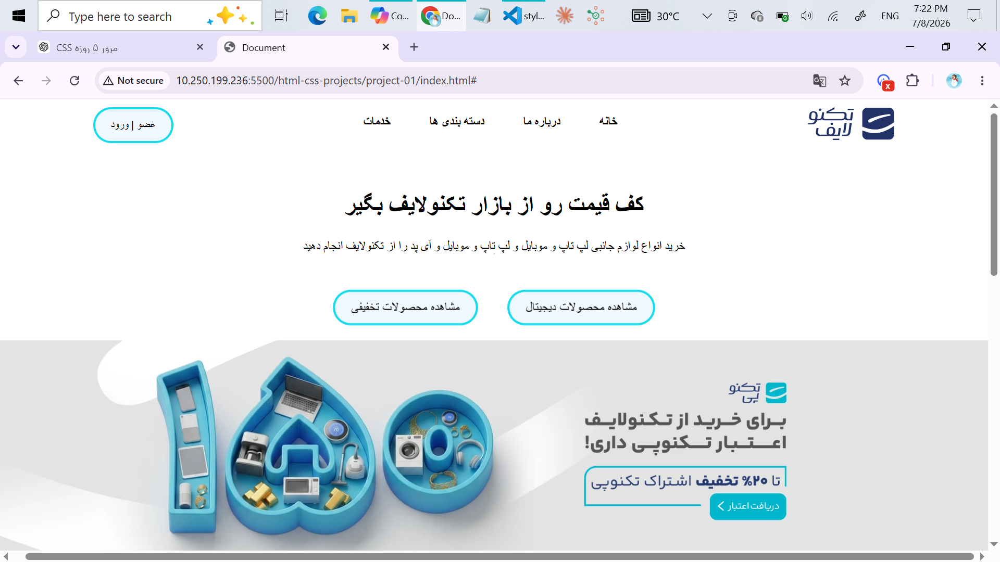
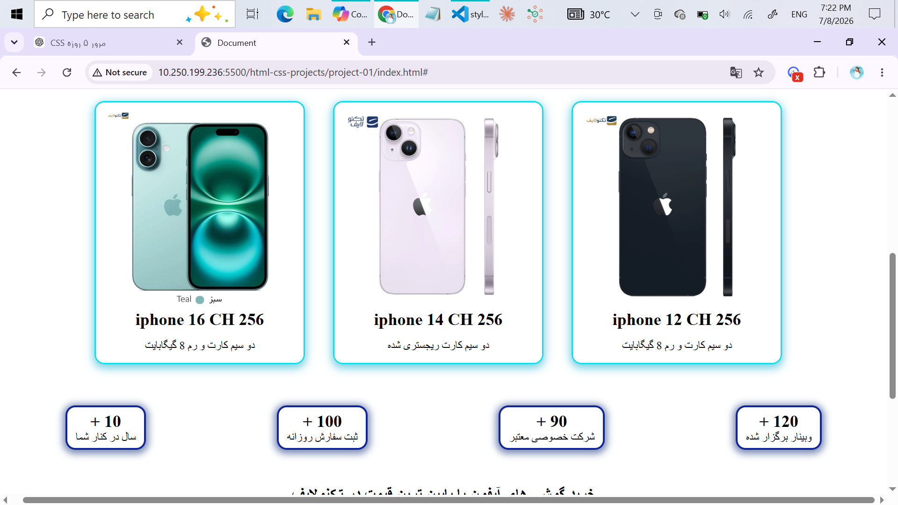
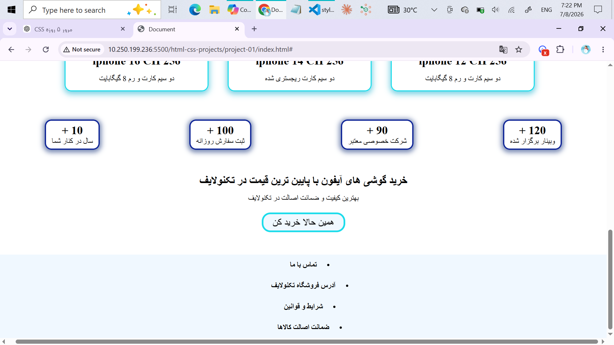
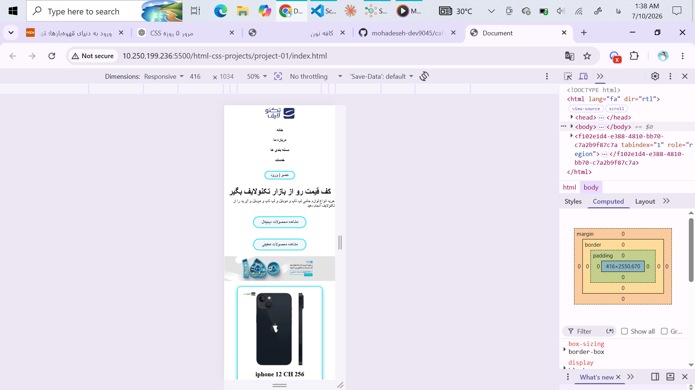
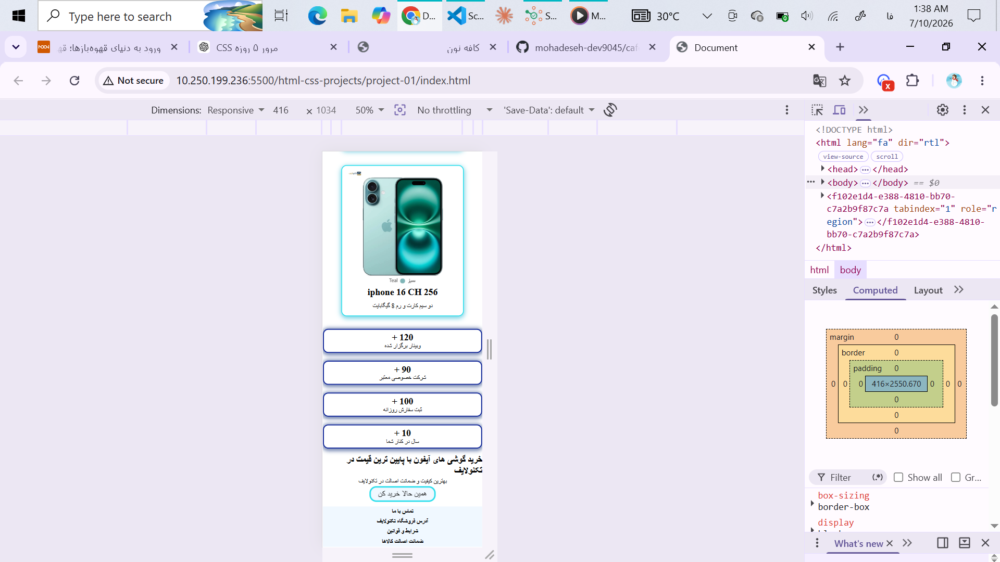
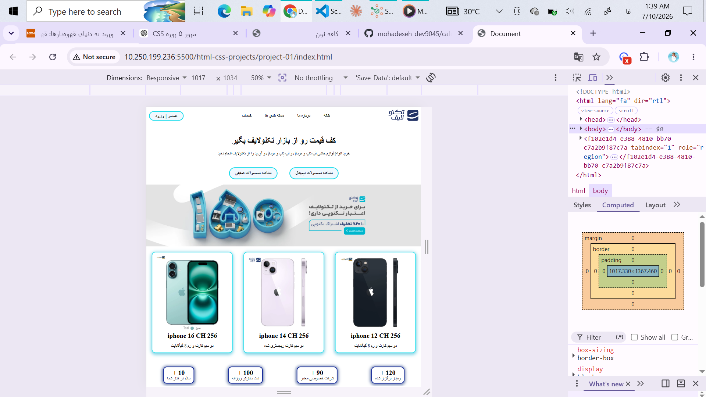
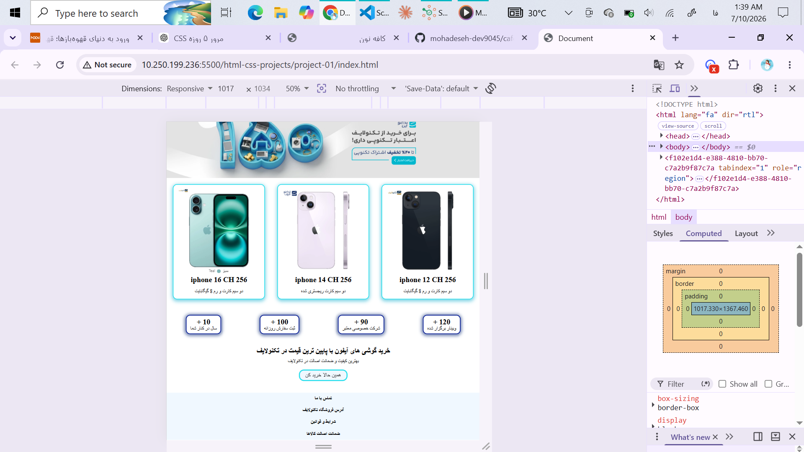

# 📱 TechnoLife Landing Page

A modern and responsive landing page inspired by the **TechnoLife** online store. This project was built using **HTML5** and **CSS3**, focusing on responsive design, semantic HTML, and clean UI.

---

## 📸 Preview

### 🖥️ Desktop

#### Header & Hero



#### Products Section



#### Statistics Section



---

### 📱 Mobile

#### Home



#### Products



---

### 📲 Tablet

#### Home



#### Products



---

## ✨ Features

- 📱 Fully Responsive Design
- 🏗️ Semantic HTML5 Structure
- 🎨 Modern CSS3 Styling
- 📦 Flexbox Layout
- 📐 Media Queries
- 🖱️ Interactive Hover Effects
- ✨ CSS Transitions & Animations
- 🧭 Responsive Navigation
- 🛍️ Product Cards
- 📊 Statistics Section
- ⚡ Clean & Organized Code

---

## 🛠️ Technologies Used

- HTML5
- CSS3
- Flexbox
- Media Queries

---

## 📂 Project Structure

```text
technolife-landing-page
│
├── README.md
│
└── project-01
    ├── images
    ├── screenshots
    │   ├── header-hero.png
    │   ├── products.png
    │   ├── stats.png
    │   ├── mobile.png
    │   ├── mobile-products.png
    │   ├── tablet.png
    │   └── tablet-products.png
    │
    ├── index.html
    └── style.css
